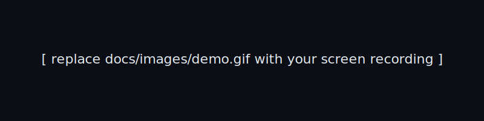

# AgentX — AI Agent Orchestration Platform

> A local, single-command platform to **build, wire, run, and observe** collaborating AI agents.
> One agent is reachable from **Telegram** so a human can converse with the swarm.

[](docs/images/demo-placeholder.svg)

---

## TL;DR — run it

**Prerequisite:** [Docker Desktop](https://www.docker.com/products/docker-desktop/) (Windows / macOS / Linux). No other tools required.

**Windows (PowerShell):**

```powershell
copy .env.example .env        # then edit .env with OPENAI_API_KEY and TELEGRAM_BOT_TOKEN
docker compose up --build     # one command: API + UI + Telegram worker
# open http://localhost:3000
```

**macOS / Linux:**

```bash
cp .env.example .env          # then edit .env with OPENAI_API_KEY and TELEGRAM_BOT_TOKEN
docker compose up --build
# open http://localhost:3000
```

Leaving `OPENAI_API_KEY` and `TELEGRAM_BOT_TOKEN` blank is fine — the platform still boots, agents run on a deterministic stub, and the Telegram adapter gracefully disables itself.

Two pre-built workflow templates (**Research → Writer** and **Triage → Specialist → Summarizer**) are seeded on first boot — pick one in the UI, click **Run**, then DM your Telegram bot to interact.

---

## Run without Docker

If you'd rather not install Docker, you can run the backend and frontend directly. Requires **Python 3.11+** and **Node.js 20+**.

### Windows (PowerShell)

One-time setup:

```powershell
copy .env.example .env        # optional: edit to add OPENAI_API_KEY / TELEGRAM_BOT_TOKEN

# Backend
cd backend
python -m venv .venv
.\.venv\Scripts\Activate.ps1
pip install -e ".[dev]"
cd ..

# Frontend
cd frontend
npm install
cd ..
```

> If PowerShell blocks the venv activation script, run once:
> `Set-ExecutionPolicy -Scope CurrentUser -ExecutionPolicy RemoteSigned`

Then in **two terminals**:

```powershell
# Terminal 1 — backend
cd backend
.\.venv\Scripts\Activate.ps1
uvicorn app.main:app --reload --port 8000
```

```powershell
# Terminal 2 — frontend
cd frontend
npm run dev
```

Open http://localhost:3000.

### macOS / Linux

```bash
cp .env.example .env

# Backend
cd backend
python3 -m venv .venv
source .venv/bin/activate
pip install -e ".[dev]"
cd ..

# Frontend
cd frontend
npm install
cd ..

# Run both (or use `make dev` as a shortcut)
( cd backend && source .venv/bin/activate && uvicorn app.main:app --reload --port 8000 ) &
( cd frontend && npm run dev )
```

Open http://localhost:3000.

### Run the tests

```bash
cd backend
pytest -q
```

---

## What you get

| Capability | Where |
|---|---|
| Create agents (name, role, prompt, model, tools, memory, schedule, guardrails) | UI → **Agents** |
| Visual workflow builder w/ conditions + feedback loops | UI → **Workflows** (React Flow) |
| Real, async multi-agent runtime executing real tools | `backend/app/runtime/` (LangGraph) |
| Telegram chat with the swarm | `backend/app/channels/telegram.py` |
| Live log stream + inter-agent messages + token/cost | UI → **Monitor** (WebSocket) |
| Persisted message history, visible in UI | SQLite via SQLAlchemy |
| 2 seeded workflow templates | `backend/app/seeds/templates.py` |
| Tests for critical paths | `backend/tests/` |

---

## Why these choices (short version — long version in [docs/ARCHITECTURE.md](docs/ARCHITECTURE.md))

- **Python + FastAPI** — gravitational center of the AI ecosystem; async-native; minimal ceremony.
- **LangGraph** as the runtime — a workflow *is* a graph. Nodes = agents, edges = transitions, conditional edges = branches, cycles = feedback loops. The visual builder maps **1:1** to the runtime, so there is no impedance mismatch between what the user draws and what executes.
- **SQLite + SQLAlchemy** — zero-ops persistence that ships in one container. Swappable for Postgres by changing one env var.
- **Telegram (long-polling)** — fully local: no public URL, no ngrok, no webhook gymnastics. Adapter pattern leaves Slack/WhatsApp as drop-in replacements.
- **Next.js 14 + React Flow + shadcn/ui** — the de-facto stack for shipping polished internal-tool UIs fast.
- **WebSocket event bus** in-process — live monitoring without Redis/Kafka for a local-first product.

---

## Architecture

```
┌────────────────────────────────────────────────────────────────────┐
│                    Next.js 14 UI  (port 3000)                      │
│   Agents · Workflows (React Flow) · Runs · Live Monitor (WS)       │
└──────────────┬─────────────────────────────────────┬───────────────┘
        REST / JSON                            WebSocket / events
               │                                     │
┌──────────────▼─────────────────────────────────────▼───────────────┐
│                      FastAPI  (port 8000)                          │
│   /agents  /workflows  /runs  /channels  /ws/monitor               │
│                                                                    │
│  ┌──────────────┐   ┌────────────────┐   ┌──────────────────────┐  │
│  │  API layer   │──▶│  Runtime       │──▶│  ChannelAdapter      │  │
│  │  (Pydantic)  │   │  (LangGraph)   │   │  base → telegram.py  │  │
│  └──────┬───────┘   └───────┬────────┘   └──────────┬───────────┘  │
│         │                   │                       │              │
│         ▼                   ▼                       ▼              │
│  ┌──────────────────────────────────────────────────────────────┐  │
│  │           SQLAlchemy  ⇄  SQLite (data/agentx.db)              │  │
│  └──────────────────────────────────────────────────────────────┘  │
│                                                                    │
│  ┌──────────────────────────────────────────────────────────────┐  │
│  │  EventBus (asyncio pub/sub) — runtime → WS clients          │  │
│  └──────────────────────────────────────────────────────────────┘  │
└────────────────────────────────────────────────────────────────────┘
```

Layer boundaries are enforced:

- **`api/`** never imports from `runtime/` internals — it calls `runtime.engine.run_workflow(...)`.
- **`runtime/`** never imports `api/` — it emits events through the `EventBus`.
- **`channels/`** depend only on the `ChannelAdapter` ABC and the API; swapping Telegram → Slack means a new file.

See [docs/ARCHITECTURE.md](docs/ARCHITECTURE.md) for the deeper rationale, data model, and sequence diagrams.

---

## Configurable dimensions per agent

| Dimension | Field | Effect |
|---|---|---|
| Identity | `name`, `role`, `avatar` | Display + routing |
| Personality | `system_prompt` | Injected as system message |
| Brain | `model`, `temperature`, `max_tokens` | LLM call params |
| Tools | `tools: string[]` | Subset of registered tools the agent may call |
| Memory | `memory_strategy` (`none` \| `window:N` \| `summary`) | Context window policy |
| Schedule | `cron` | Trigger workflow on a schedule |
| Skills | `skills: string[]` | Free-form tags surfaced to router agents |
| Interaction rules | `can_talk_to: agentId[]` | Hard ACL on agent-to-agent messaging |
| Guardrails | `max_steps`, `max_cost_usd`, `denylist_regex` | Runtime kill-switches |
| Channels | `channels: ['telegram', ...]` | Which inboxes the agent listens on |

All of this is editable in the Agents form and persisted as JSON columns.

---

## Extending the platform

### Add a new workflow template

1. Add a function returning a `WorkflowSpec` to `backend/app/seeds/templates.py`.
2. Register it in the `TEMPLATES` dict at the bottom of that file.
3. Restart — it appears in the UI's **+ From template** menu.

### Add a new messaging channel (e.g., Slack)

1. Create `backend/app/channels/slack.py` subclassing `ChannelAdapter` (`start`, `stop`, `send`).
2. Register it in `channels/__init__.py`'s `REGISTRY`.
3. Add the channel string to an agent's `channels` field in the UI.

No other code changes required — the API and UI iterate the registry.

---

## Tests

```bash
cd backend && pytest -q
```

Critical-path coverage:

- `test_agents.py` — agent CRUD + validation
- `test_workflow.py` — graph compilation + a 2-agent run executing a real tool
- `test_telegram.py` — adapter delivers an inbound message to the runtime (mocked transport)

---

## Project layout

```
agentx/
├─ backend/                     Python · FastAPI · LangGraph
│  ├─ app/
│  │  ├─ api/                   HTTP + WS routes
│  │  ├─ runtime/               Engine, tools, memory, guardrails
│  │  ├─ channels/              Telegram adapter (+ ABC for more)
│  │  ├─ models/                SQLAlchemy ORM
│  │  ├─ seeds/                 Pre-built workflow templates
│  │  ├─ events.py              In-process pub/sub
│  │  ├─ db.py · config.py · main.py
│  └─ tests/
├─ frontend/                    Next.js 14 · TS · Tailwind · React Flow
│  ├─ app/                      Routes: /, /agents, /workflows, /runs, /monitor
│  ├─ components/
│  └─ lib/
├─ docs/
│  └─ ARCHITECTURE.md
├─ docker-compose.yml
├─ Makefile
└─ .env.example
```

---

## Demo script (what I'll show in the live session)

1. `docker compose up` — UI + API + Telegram worker boot.
2. Open `/agents` — show the 4 seeded agents and edit one's guardrails.
3. Open `/workflows` — open the **Research → Writer** template, walk the graph.
4. Click **Run**, send the goal: *"Write a 150-word brief on AgentX's value proposition."*
5. Open `/monitor` — watch the live log stream, inter-agent messages, and cost ticker.
6. Switch to Telegram, message `@your_bot`: *"Status?"* — the Concierge agent answers, then delegates to the workflow.
7. Walk the code: API layer → runtime → channel adapter → tests passing.

---

## License

MIT — see `LICENSE`.
